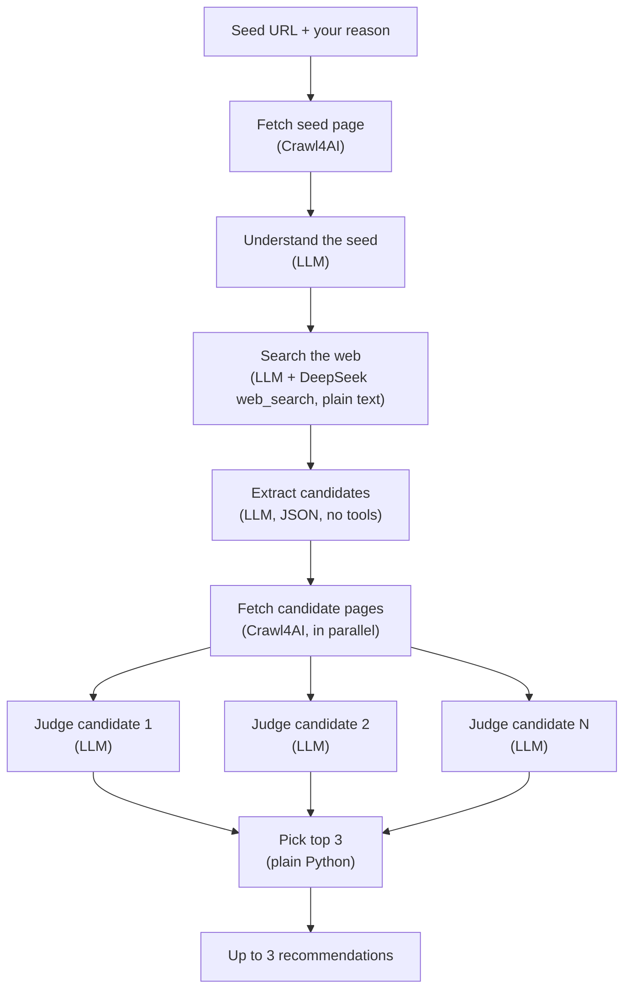

# Bookmark Recommender Flow Observability

You give it a bookmark (a URL) and the reason it matters to you. It recommends up to three other websites that are **relevant**, **useful** and **novel**. Every run is traced end to end in Arize Phoenix.

> **Status:** working first version, run end to end against the real DeepSeek API with traces in Phoenix.

## What it does

Each candidate site is scored from 1 to 5 on three criteria:

| Criterion | Question |
|---|---|
| Relevance | How closely is this bookmark related to the given bookmark? |
| Usefulness | How valuable is this bookmark to the user's likely intent? |
| Novelty | Does it cover something the original page does not? |

## How it works

A fixed LangGraph workflow. It isn't an agent, because the steps are known ahead of time:



- **LLM:** DeepSeek through LangChain's `ChatOpenAI` (Responses API). Search uses DeepSeek's built-in `web_search` tool.
- **Search and extraction are separate calls.** DeepSeek's web search never finished when it was asked for JSON, so it answers in plain text and a second, tool-free call turns that answer into structured candidates.
- **Page fetching:** Crawl4AI
- **Judging:** an LLM-as-judge with a 1–5 rubric. The final ranking is plain Python.
- **CLI:** `rich`

## Observability

- Each recommendation request is one **trace**: a tree of spans for the graph, each step, each LLM call and each page fetch.
- All requests in one CLI run share a **session**.
- Instrumentation uses OpenTelemetry with OpenInference conventions: the LangChain auto-instrumentor plus manual spans for the crawler. Judge scores are attached to spans as attributes.
- Traces go to a local [Arize Phoenix](https://github.com/Arize-ai/phoenix) server.

## Running it

Requires Python 3.12 and a [DeepSeek API key](https://platform.deepseek.com/).

1. Install the dependencies and the browser Crawl4AI uses:

   ```bash
   pip install -r requirements.txt
   python -m playwright install chromium
   ```

2. Put your key in a `.env` file in the project root:

   ```
   DEEPSEEK_API_KEY=your-key
   ```

3. Start Phoenix in one terminal, then open http://localhost:6006:

   ```bash
   phoenix serve
   ```

4. Run the app in a second terminal:

   ```bash
   python -m bookmark_recommender
   ```

   Paste a URL, say why it matters to you, and wait for up to three recommendations. Enter `q` or an empty URL to quit. Each run of the app is one session in Phoenix.

**Cost and time:** in our test run, one recommendation took about 80 seconds and about 52k input tokens. Most of both went to the web-search call.

To use a Phoenix server somewhere else, set `PHOENIX_COLLECTOR_ENDPOINT`.

## Tests

```bash
pytest
```

The tests use fakes for the LLM and the crawler, so they make no network calls.
